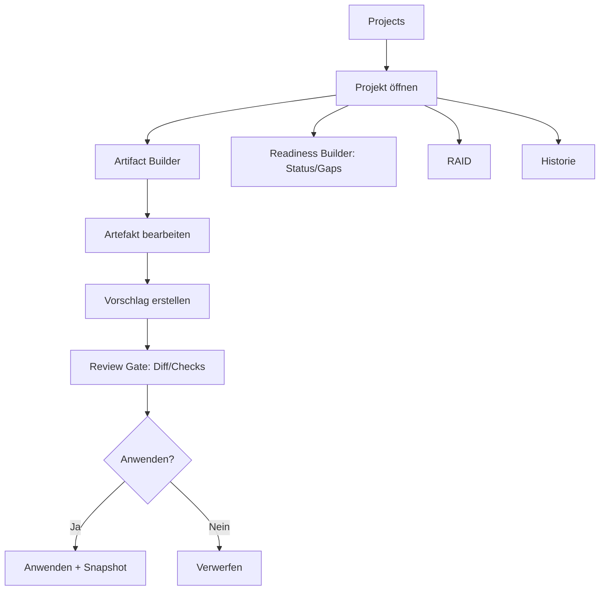
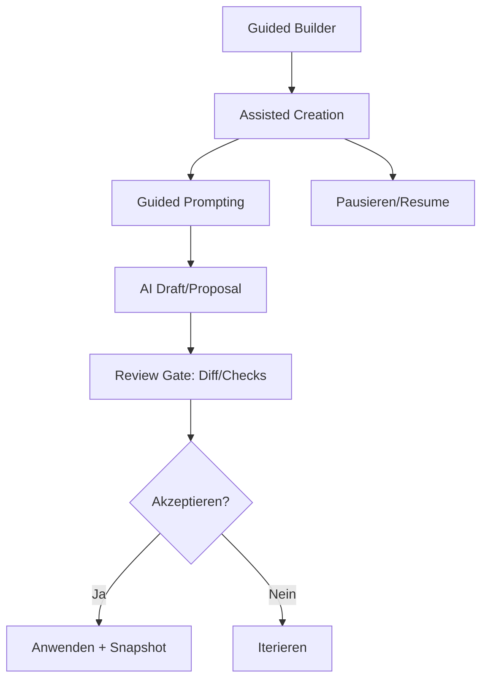

# UI-Client UX Review – Workflow Map, Findings, Recommendation (1/2/3)

**Datum:** 2026-02-09  
**Scope:** UI-Client (React/TypeScript) im Multi-Repo-Setup. Fokus: UX/Ergonomie/Logik, speziell parallele Workflows zur Projekterstellung, Artefaktpflege und Reifegradprüfung inkl. AI-Assist.  
**Methode:** Statische Strukturprüfung + UX-Heuristiken. Kein Live-Usability-Test.

---

## 1) Workflow Map (beide Wege)

### Domänenmodell
- Project, Artifact, Readiness, Proposal/Change, RAID, History/Snapshot, Sync/Conflicts

### Workflow A – UI-first (Listen/Tabs/Forms)

### Workflow B – Guided Builder (Assisted Creation)

---

## 2) Top-Findings (Severity S0–S3)

**S0 Blocker**
1. Dead-ends (fehlende Detailrouten/Aktionen) für Kernobjekte (Artefakt/RAID).
2. Routing-/Param-Inkonsistenzen (z. B. `projectKey` vs `key`).

**S1 High**
3. Proposal-Erstellung ist developer-lastig (JSON als Primärinput) → Form/Schema UI nötig.
4. Guided Builder ist nicht sichtbar als primärer Einstieg → CTAs/Navigation verstärken.
5. Review/Undo/History nicht überall als Standardprinzip sichtbar.

**S2 Medium**
6. „Where am I / What next“ im Projekt schwach → Readiness Panel (Status + Gaps + CTA).
7. Offline/Disconnected ohne Recovery UX → klare Aktionen (Work offline / Retry / Details).
8. A11y: Clickable Rows ohne echte Links/Buttons → Semantik/Keyboard/Fokus.

**S3 Low**
9. Empty States/CTA-Platzierung inkonsistent → Pattern festlegen.
10. Table/Filter Pattern nicht standardisiert → ein Pattern + QueryParam Sync.

---

## 3) Empfehlung
- **Guided Builder / Assisted Creation** als primärer Erstell-/Verbesserungsweg.
- **UI-first** als Review/Status/Navigation/Expert Shortcuts.
- **Review Gate** (Diff + Checks + Apply/Reject) ist Pflicht.
- **Offline-first (Git-backed)**: Draft/Snapshot/History/Sync/Conflict UI abstrahiert Git.

---

## Offene Fragen
1. Primäre Nutzerrollen?
2. Welche Artefakt-Typen (Text/JSON/Binary)?
